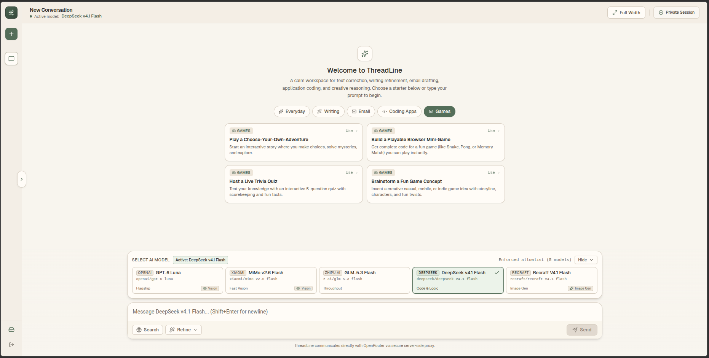
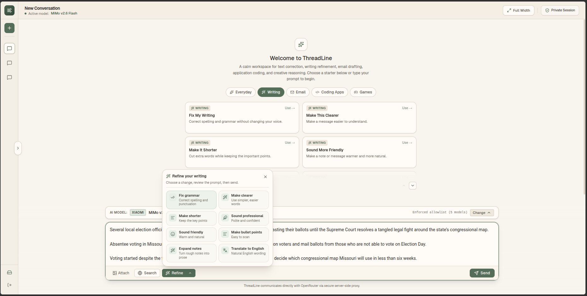
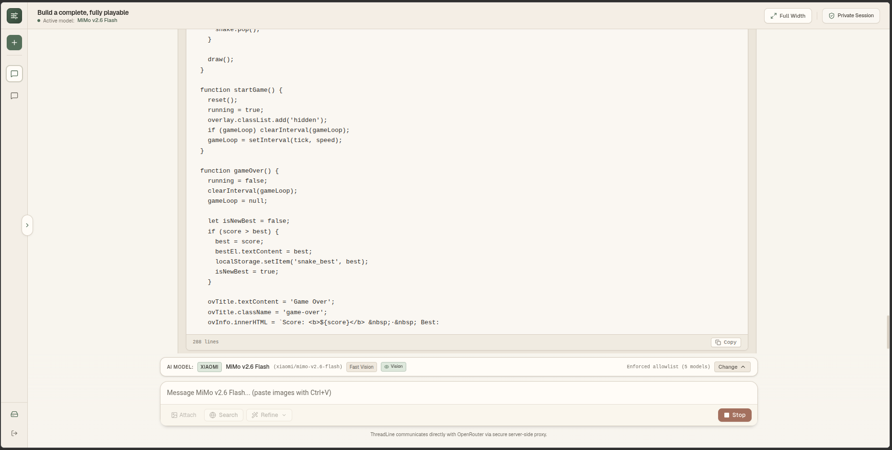
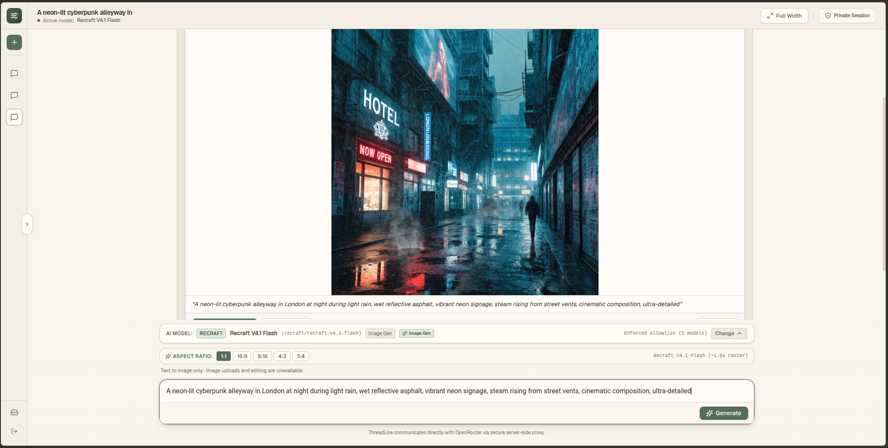

# ThreadLine

A private, single-user AI chat interface built with Next.js App Router, React, TypeScript, and Tailwind CSS. Designed to run on the Vercel Hobby tier with no external database requirements.



## Features

- **Private Single-User Access**: Protected by a master password hashed with bcrypt and cryptographically signed session cookies.
- **Multiple Models**: Query flagship, high-speed, coding, and image generation models via OpenRouter (GPT-6 Luna, MiMo v2.6 Flash, GLM-5.3 Flash, DeepSeek v4.1 Flash, and Recraft V4.1 Flash).
- **Mid-Chat Model Switching**: Switch models mid-conversation with per-message model attribution.
- **Web Search**: Real-time search integration with Tavily, providing inline citations and source previews.
- **Image Generation**: Generate images with Recraft V4.1 Flash supporting multiple aspect ratios.
- **Dedicated Translation Mode**: Toggle Translate to route prompts to Google Gemma 4 26B (`google/gemma-4-26b-a4b-it`) with support for Auto Detect and over 25 languages.
- **Image Uploads & Vision**: Upload images with automatic browser-side resizing and request-budget pruning.
- **Local Storage**: All conversation history is stored strictly in your browser local storage.

## Screenshots

### Conversation & Web Search


### Code Generation & Syntax Highlighting


### Text-to-Image Generation


## Getting Started

### 1. Clone and Install

```bash
git clone https://github.com/ClaudiuJitea/ThreadLine.git
cd ThreadLine
npm install
```

### 2. Configure Environment Variables

Create `.env.local` from the provided example:

```bash
cp .env.example .env.local
```

Generate your password hash:
```bash
npm run hash-password
```

Generate your session signing secret:
```bash
npm run generate-secret
```

Add your keys to `.env.local`:

```env
OPENROUTER_API_KEY="sk-or-v1-your-openrouter-key"
APP_PASSWORD_HASH="your-generated-bcrypt-hash"
SESSION_SECRET="your-generated-session-secret"

# Optional: Tavily API key for web search
TAVILY_API_KEY="tvly-your-tavily-key"
```

### 3. Run Locally

```bash
npm run dev
```

Open [http://localhost:3000](http://localhost:3000) in your browser.

## Deployment

ThreadLine is optimized to deploy directly to Vercel:

1. Push your repository to GitHub.
2. Import the repository into Vercel.
3. Add `OPENROUTER_API_KEY`, `APP_PASSWORD_HASH`, and `SESSION_SECRET` (and optionally `TAVILY_API_KEY`) under **Settings > Environment Variables**.
4. Deploy.

## License

MIT
