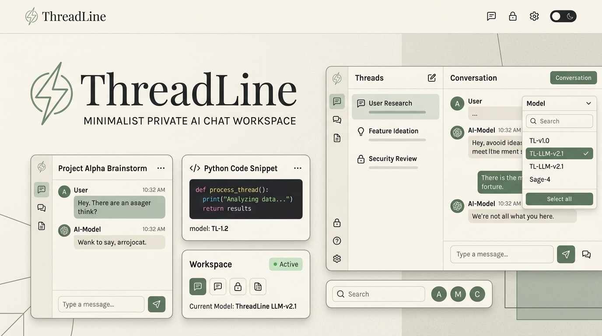
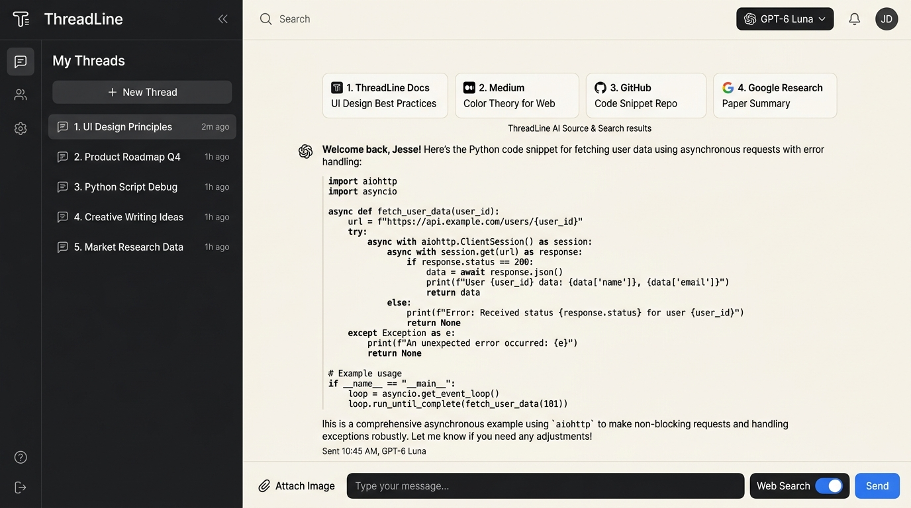

<div align="center">



# ThreadLine ⚡

**A high-performance, single-user, private AI workspace and chat interface.**  
*Crafted with Next.js 16 (App Router), React 19, TypeScript, and Tailwind CSS.*

[](https://nextjs.org/)
[](https://react.dev/)
[](https://www.typescriptlang.org/)
[](https://tailwindcss.com/)
[](https://vercel.com/)
[](#license)

<br />

[Features](#-key-features) •
[UI Preview](#-interface-preview) •
[Security Architecture](#-private-access--security-architecture) •
[Supported Models](#-supported-models) •
[Local Setup](#-local-setup-guide) •
[Vercel Deployment](#-vercel-deployment-steps-hobby-tier)

</div>

---

## 🌟 Overview

**ThreadLine** is designed as a calm, distraction-free, personal AI command center for a single user. It runs entirely on the **Vercel Hobby Tier** with **zero external database dependencies**, zero paid authentication providers, and zero tracking.

Everything you say and generate stays under your control: conversations are persisted directly in your browser's `localStorage`, authentication is enforced with hardened bcrypt hashing and signed JWT cookies, and API traffic routes straight to your chosen LLM via OpenRouter.

---

## 📸 Interface Preview

<div align="center">


*ThreadLine featuring conversational threads, multi-model selection, inline code highlighting, and Perplexity-style web search citations.*

</div>

---

## ✨ Key Features

- 🔒 **Single-User Vault**: No public sign-ups, user tables, or third-party auth services. Master password verification is backed by `bcrypt` (12 rounds) and cryptographically signed `jose` HS256 cookies.
- 🤖 **Curated Model Roster**: Instant switching between flagship reasoning, rapid vision, throughput, coding logic, and image generation.
- 🔀 **Mid-Thread Model Switching**: Change models on the fly mid-conversation. Responses retain attribution to the model that generated them without silent substitution.
- 🌐 **Perplexity-Style Web Search**: Toggle real-time search powered by Tavily with SSRF filtering, prompt-injection isolation, and interactive source cards with inline citations `[1]`, `[2]`.
- 🎨 **Text-to-Image Generation**: Direct integration with Recraft V4.1 Flash supporting multiple aspect ratios (`1:1`, `16:9`, `9:16`, `4:3`, `3:4`).
- 🖼️ **Client-Side Vision Budgeting**: Uploaded images are compressed via HTML5 Canvas (max 1200px) and dynamically budgeted to keep payloads comfortably below Vercel's serverless ceiling (< 2.4MB).
- 💾 **Local-First Privacy**: Base64 image data is never dumped into `localStorage`, keeping browser quotas safe while chat threads stay purely client-side.
- 🌿 **Warm Editorial Aesthetic**: Purpose-crafted calming palette (`#F8F5EF` canvas, `#FFFCF7` cards, `#536E59` sage green accents) inspired by fine stationery and notebooks.
- 🧪 **Built-In Security Test Suite**: Automated verification scripts ensuring every route, cookie, CSRF barrier, and allowlist rule behaves as expected.

---

## 🔒 Private Access & Security Architecture

ThreadLine implements defense-in-depth directly at the application boundary:

1. **Zero Public Exposure**: Registration links, email sign-ups, and OAuth callbacks do not exist.
2. **Server-Side Password Verification**: Your password hash (`APP_PASSWORD_HASH`) is stored securely in environment variables. Plaintext passwords never touch disk.
3. **Cryptographically Signed Session Cookies**: Successful logins issue an encrypted JWT cookie (`threadline_session`) with:
   - `HttpOnly: true` (inaccessible to JavaScript, defending against XSS)
   - `Secure: true` (transmitted exclusively over HTTPS in production)
   - `SameSite: Lax` (mitigating CSRF)
   - `Max-Age: 7 days`
4. **Secret Rotation**: Rotating `SESSION_SECRET` immediately invalidates all active sessions everywhere.
5. **CSRF & Origin Verification**: State-changing endpoints (`/api/auth/login`, `/api/auth/logout`, `/api/chat`) strictly enforce same-origin verification and block cross-site requests.
6. **In-Route Session Checks**: `/api/chat` independently validates the session cookie before ever dispatching a request to external gateways. A missing or invalid cookie will **never** trigger an OpenRouter or Tavily call.
7. **Strict Model Allowlist**: Endpoints reject unlisted model IDs with a `400 Bad Request`.
8. **Fail-Closed Principle**: If any mandatory environment variable is absent (`OPENROUTER_API_KEY`, `APP_PASSWORD_HASH`, `SESSION_SECRET`), the server immediately rejects requests with `500`.

---

## 🤖 Supported Models

ThreadLine maintains a strict server/client allowlist for peak reliability and predictable costs:

| Model | Provider | ID | Specialty |
| :--- | :--- | :--- | :--- |
| **GPT-6 Luna** | OpenAI | `openai/gpt-6-luna` | Flagship reasoning, deep intelligence & multimodal vision |
| **MiMo v2.6 Flash** | Xiaomi | `xiaomi/mimo-v2.6-flash` | High-speed multimodal conversation & rapid response |
| **GLM-5.3 Flash** | Zhipu AI | `z-ai/glm-5.3-flash` | Efficient bilingual high-throughput agent |
| **DeepSeek v4.1 Flash** | DeepSeek | `deepseek/deepseek-v4.1-flash` | Advanced coding, mathematical logic & analytical tasks |
| **Recraft V4.1 Flash** | Recraft | `recraft/recraft-v4.1-flash` | Sub-second high-fidelity raster image generation |

---

## 🛠️ Local Setup Guide

### 1. Prerequisites
- **Node.js**: v18+ (Node 20 or 22 LTS recommended)
- **npm**: v9+
- An [OpenRouter API Key](https://openrouter.ai/)
- *(Optional)* A [Tavily API Key](https://tavily.com/) for live web search

### 2. Clone and Install Dependencies
```bash
git clone https://github.com/ClaudiuJitea/ThreadLine.git
cd ThreadLine
npm install
```

### 3. Generate Security Credentials

#### A. Generate `APP_PASSWORD_HASH`
Run the password hashing utility interactively:
```bash
npm run hash-password
```
*Or pass your password directly with single quotes:*
```bash
npm run hash-password -- 'YourStrongPasswordHere!'
```

#### B. Generate `SESSION_SECRET`
Generate a cryptographically secure 256-bit hex secret:
```bash
npm run generate-secret
```

### 4. Configure Environment Variables
Copy the template to `.env.local`:
```bash
cp .env.example .env.local
```
Update `.env.local` with your generated values:
```env
# Server-only secrets (DO NOT prefix with NEXT_PUBLIC_)
OPENROUTER_API_KEY="sk-or-v1-your-actual-openrouter-key"
APP_PASSWORD_HASH="your-generated-bcrypt-hash"
SESSION_SECRET="your-generated-64-character-hex-session-secret"

# Optional: Real-time web search
TAVILY_API_KEY="tvly-your-tavily-api-key"
```

### 5. Launch the Dev Server
```bash
npm run dev
```
Open [http://localhost:3000](http://localhost:3000) and log in with your master password.

---

## 🚀 Vercel Deployment Steps (Hobby Tier)

ThreadLine requires **no external database** and **no paid auth tier**.

### Step 1: Push Repository to GitHub
```bash
git add .
git commit -m "Initial ThreadLine release"
git push origin main
```

### Step 2: Import into Vercel
1. Navigate to the [Vercel Dashboard](https://vercel.com).
2. Click **Add New...** -> **Project**.
3. Import your `ThreadLine` repository.
4. Framework Preset: **Next.js** (detected automatically).

### Step 3: Add Environment Variables
Under **Environment Variables**, configure:

| Variable Name | Required | Description |
| :--- | :---: | :--- |
| `OPENROUTER_API_KEY` | **Yes** | Your OpenRouter secret key |
| `APP_PASSWORD_HASH` | **Yes** | Bcrypt hash from `npm run hash-password` |
| `SESSION_SECRET` | **Yes** | 64-char hex string from `npm run generate-secret` |
| `TAVILY_API_KEY` | *Optional* | Tavily API key for web search toggle |

> [!IMPORTANT]
> Never prefix these variables with `NEXT_PUBLIC_`. Add them to **Production**, **Preview**, and **Development** environments.

### Step 4: Deploy
Click **Deploy**. Your private workspace will be live at `https://<your-project>.vercel.app`.

---

## 🛡️ Vercel WAF Rate-Limiting (Recommended)

To defend your login endpoint against brute-force attempts on the Hobby tier:

1. Open your project on [Vercel](https://vercel.com).
2. Navigate to **Security** -> **WAF / Firewall**.
3. Click **Create Rule**:
   - **Rule Name**: `Rate Limit Login Attempts`
   - **Condition**: Request Path equals `/api/auth/login` and Method equals `POST`
   - **Keyed By**: **IP Address** (`client.ip`)
   - **Action**: **Rate Limit**
   - **Limit**: e.g. `5 requests per 1 minute`
   - **Response**: `429 Too Many Requests`
4. Click **Save and Enable**.

---

## 🧪 Security & Verification Test Suite

Run the built-in automated test suite to verify route guards, CSRF handling, allowlist enforcement, and cookie security:

```bash
npm run test:security
```

Tests cover:
- [x] Unauthenticated redirect from `/` to `/login`
- [x] Unauthorized direct calls to `/api/chat` blocked with `401`
- [x] Tampered/forged cookies rejected
- [x] Cross-origin CSRF POST requests blocked with `403`
- [x] Invalid password rejected with `401`
- [x] Valid password issues `HttpOnly`, `SameSite=Lax`, `Secure` cookie
- [x] Model allowlist strictly enforced (`400` on unlisted models)
- [x] Graceful degradation when optional keys are omitted

---

## 📁 Repository Structure

```
ThreadLine/
├── .env.example                     # Environment template with instructions
├── .gitignore                       # Strict ignore rules for secrets and build files
├── docs/
│   ├── APP_ARCHITECTURE.md         # Deep-dive system architecture specification
│   └── images/                     # UI screenshots and banners for documentation
├── scripts/
│   ├── generate-password-hash.mjs   # Password hashing tool
│   ├── generate-session-secret.mjs  # Cryptographic secret generator
│   ├── test-security.mjs            # Security test runner
│   └── test-web-search.mjs          # Tavily integration test runner
├── src/
│   ├── proxy.ts                     # Route protection & session redirect proxy
│   ├── app/
│   │   ├── page.tsx                 # Protected main workspace page
│   │   ├── layout.tsx               # Root layout & theme definitions
│   │   ├── login/                   # Secure login interface
│   │   └── api/
│   │       ├── auth/                # Login, logout, and session check endpoints
│   │       └── chat/                # OpenRouter SSE streaming proxy & vision budgeter
│   ├── components/
│   │   ├── ChatContainer.tsx        # High-level state & thread coordinator
│   │   ├── ChatArea.tsx             # Message feed, input composer & streaming view
│   │   ├── Sidebar.tsx              # Thread history, rename, delete, search
│   │   ├── ModelSelector.tsx        # Model switcher with capability badges
│   │   ├── MarkdownRenderer.tsx     # Syntax-highlighted code blocks & typography
│   │   └── WebSearchSources.tsx     # Perplexity-style source cards & citations
│   └── lib/
│       ├── auth.ts                  # Bcrypt verification, jose JWT, CSRF defenses
│       ├── models.ts                # Shared model allowlist
│       ├── storage.ts               # LocalStorage conversation persistence
│       ├── image-utils.ts           # Canvas compression & payload budgeting
│       └── search/                  # Tavily search integration & SSRF sanitization
├── package.json
└── tsconfig.json
```

---

## 📄 License

Distributed under the MIT License. See [LICENSE](LICENSE) for details.
